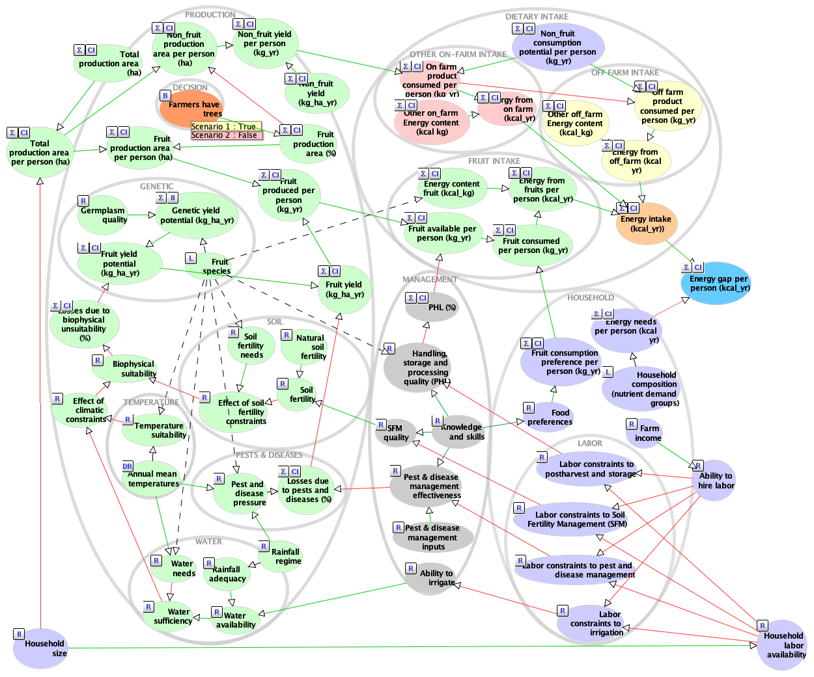
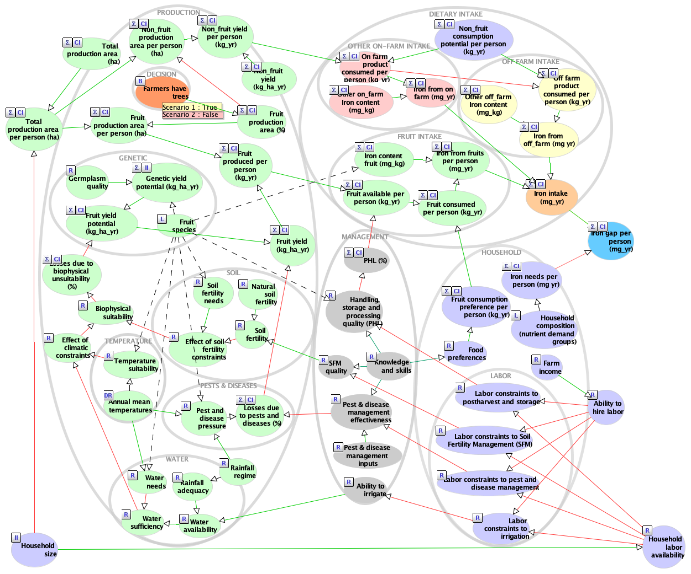
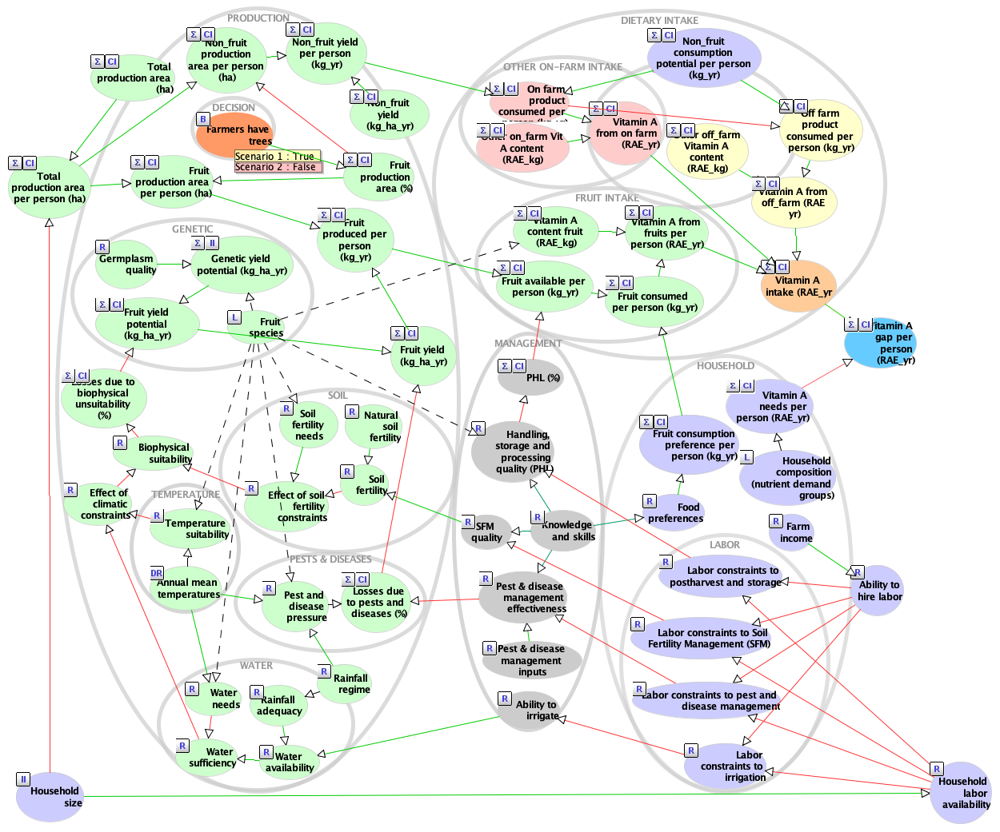
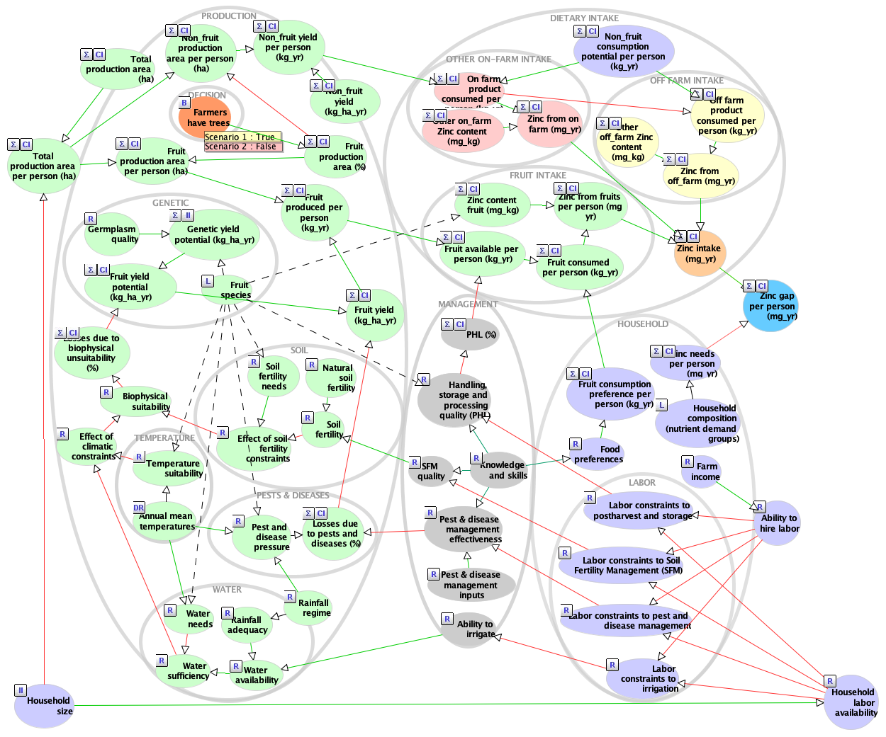

Supplementary: Integration of fruit trees for better nutrition – Case
study in Kenya

Cory Whitney and Eike Luedeling University of Bonn

## Bayesian Network models

The Bayesian Network models are given below. The green nodes within the
‘Production’ sub-module illustrate the computation used to arrive at the
volume, quality and nutrient content of the available fruit. The purple
nodes within the ‘Household’ sub-module represent household composition.
Together these illustrate the computation used to arrive at the
household fruit consumption potential, labor availability, and nutrient
needs per year and per farm. The values generated for nutrient intakes
and demands are generated based on the types of individuals represented
in the ‘Household Composition (nutrient demand groups)’ node. The node
states are ‘Healthy pregnant woman’, ‘Healthy lactating woman’, ‘Healthy
not reproducing woman’, ‘Unhealthy pregnant woman’, ‘Unhealthy lactating
woman’, ‘Unhealthy not reproducing woman’, ‘Healthy man’, ‘Unhealthy
man’, ‘Healthy adolescent’, ‘Unhealthy adolescent’, ‘Healthy child’,
‘Unhealthy child’, ‘Healthy infant’, ‘Unhealthy infant’, ‘Healthy
elderly’, and ’Unhealthy elderly. Specific information about the needs
of these is shown in the Supplementary (Luedeling and Whitney 2018).

In the following models the grey outline circles represent sub-modules
of related nodes used to generate probabilities of the respective model
parts. Green arrows indicate positive effects and red arrows indicate
negative effects. Model built in the AgenaRisk software (Fenton and Neil
2017).

Under the proposed policy, both papaya and mango trees are expected to
be introduced into and managed within smallholder household farms and
gardens. Papaya is typically managed as a sparsely-branched tree,
typically quite tall. It can take from six to twelve months from seed to
fruit. A serving of papaya of 200 grams contains roughly 4% of the daily
recommended calories, 12% of vitamin A, and 1% of iron and zinc. Mango
is typically managed as a large tree. It can take five to eight years
from seed to fruit, nursery saplings can take about four years. A
serving of mango of 200 grams contains roughly 5% of the daily
recommended calories and vitamin A, 1% of iron, and zinc. We worked
together with stakeholders to gather knowledge about the possible costs
and risks of the introduction of these trees to farming systems and the
expected benefits to the nutrition of farming households.

### Energy

<figure>

<figcaption aria-hidden="true">Bayesian Network model of the household
nutritional energy impacts of planting fruit trees on farms in Kenya.
The model calculates probabilities for the expected impact on the annual
energy intake gap among rural farming households given the intervention
to provide planting materials for fruit trees.</figcaption>
</figure>

For the results of the Value of information analysis see the full list
of AgenaRisk generated [EV(P)PI and EV\|PI
values](https://htmlpreview.github.io/?raw.githubusercontent.com/CWWhitney/kenya_fruit_trees/main/data/EVPI_Minimized/EVPI_Energy.html).
We are mainly interested in the EVPI (last collection of values in the
display). For more information, and for running locally, see [the full
model in AgenaRisk](./Models/BN_Model_Energy_170613.cmp). This includes
all respective tables of probability.

### Iron

<figure>

<figcaption aria-hidden="true">Bayesian Network model of the household
nutritional impacts in terms of dietary iron of planting fruit trees on
farms in Kenya. The model calculates probabilities for the expected
impact on the annual iron intake gap among rural farming households
given the intervention to provide planting materials for fruit
trees.</figcaption>
</figure>

For the results of the Value of information analysis see the full list
of AgenaRisk generated [EV(P)PI and EV\|PI
values](https://htmlpreview.github.io/?raw.githubusercontent.com/CWWhitney/kenya_fruit_trees/main/data/EVPI_Minimized/EVPI_Iron.html).
We are mainly interested in the EVPI (last collection of values in the
display). For more information, and for running locally, see [the full
model in AgenaRisk](./Models/BN_Model_Iron_170613.cmp). This includes
all respective tables of probability.

### Vitamin A

<figure>

<figcaption aria-hidden="true">Bayesian Network model of the household
nutritional Vitamin A impacts of planting fruit trees on farms in Kenya.
The model calculates probabilities for the expected change in the annual
gap of Vitamin A intake among rural farming households given the
intervention to provide planting materials for fruit trees.</figcaption>
</figure>

For more information, and for running locally, see [the full model in
AgenaRisk](./Models/BN_Model_Vit_A_170613.cmp). This includes all
respective tables of probability. For the results of the Value of
information analysis see the full list of AgenaRisk generated [EV(P)PI
and EV\|PI
values](https://htmlpreview.github.io/?raw.githubusercontent.com/CWWhitney/kenya_fruit_trees/main/data/EVPI_Minimized/EVPI_Vit_A.html).
We are mainly interested in the EVPI (last collection of values in the
display).

### Zinc

<figure>

<figcaption aria-hidden="true">Bayesian Network model of the household
nutritional Zinc impacts of planting fruit trees on farms in Kenya. The
model calculates probabilities for the expected change in the annual gap
of Zinc intake among rural farming households given the intervention to
provide planting materials for fruit trees.</figcaption>
</figure>

For more information on household nutritional Zinc impacts, and for
running locally, see [the full model in
AgenaRisk](./Models/BN_Model_Zinc_170415.cmp). This includes all
respective tables of probability. For the results of the Value of
information analysis see the full list of AgenaRisk generated [EV(P)PI
and EV\|PI
values](https://htmlpreview.github.io/?raw.githubusercontent.com/CWWhitney/kenya_fruit_trees/main/data/EVPI_Minimized/EVPI_Zinc.html).
We are mainly interested in the EVPI (last collection of values in the
display).

# References

Fenton, N., and M. Neil. “AgenaRisk Professional Version 7.0.” Revision
3451 VOI, 2017.

Luedeling, E., and Cory Whitney. “Probabilistic Causal Models for
Nutrition Outcomes of Agricultural Actions - Kenya Model.” Probabilistic
Causal Models for Nutrition Outcomes of Agricultural Actions, 2018.
